 

  
   
  

 

 

 

 
 ### Main skills:
&nbsp;
&nbsp;
&nbsp;
&nbsp;
&nbsp;
&nbsp;
&nbsp;

### 🚀 About Me

I am a Fullstack Software Engineer with 4 years of experience building web and mobile applications. I enjoy working across the entire stack because it gives me a clear view of how a feature moves from the user interface to the database and cloud infrastructure. My goal is always to write clean, reliable code that solves real problems for users and businesses.

#### 🌟 Key Technical Contributions

* **System Optimization:** During my time at Sidia, I identified and addressed a critical database bottleneck by implementing a dedicated system storage solution for file management. This proactive shift prevented database bloat and ensured the application remained performant as data volume scaled.
* **Cross-Platform Development:** Contributed to a large-scale automation ecosystem for mass cell phone testing. I worked developing frontend management interfaces and mobile components (Kotlin/Android) to facilitate concurrent testing cycles across multiple devices.
* **Operational Dashboards & Integrations:** I developed a performance dashboard that allows teams to track critical metrics like response times and conversion rates. I also have experience building native integrations with Meta’s Conversion API (CAPI) and Google Sheets to automate manual workflows and improve data accuracy.

#### 💻 Developer Profile

I thrive in roles where I can be a versatile developer who dives into the technical details. I have practical experience implementing real-time features with **Websockets** and **MQTT**, managing data flows with **Apache Kafka**, and ensuring reliability through **Jest** and **Cypress** testing. My technical curiosity has also led me to build and deploy full-stack applications using **AWS** (S3, Lambda, API Gateway, Cognito) and **React Native**, giving me a solid understanding of how to manage and deploy cloud-native environments from end to end.

#### 🛠 Technical Toolkit

* **Frontend:** ReactJS, NextJS, TypeScript, React Native, Tailwind CSS, MUI.
* **Backend:** Node.js (Express), C# (ASP.NET), Kotlin, Python, Cloud Functions.
* **Real-time & Data:** Websocket, MQTT, Apache Kafka, PostgreSQL, MongoDB, Firebase.
* **Infrastructure & Testing:** AWS (S3, Lambda, API Gateway, Cognito), Jest, Cypress.

